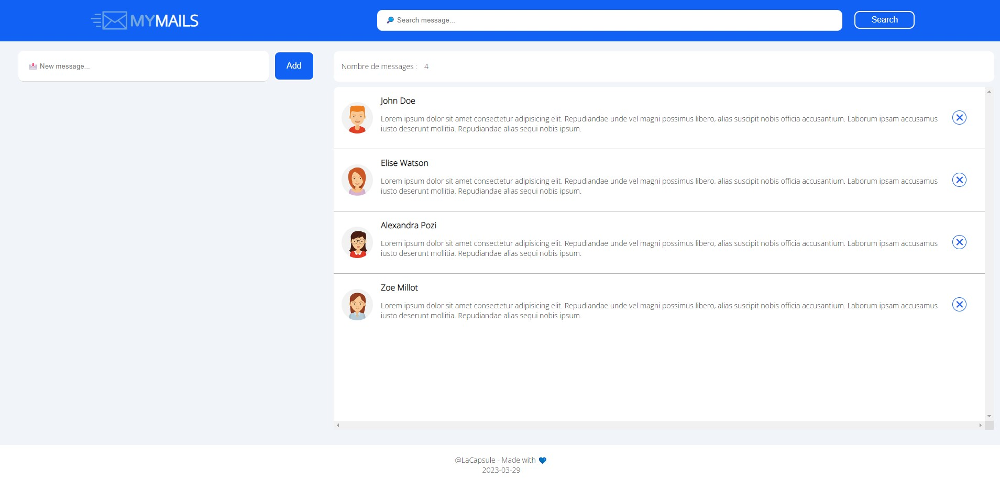

# My-Mails

[Link to Vercel deployment](https://my-mails-psi.vercel.app/)

My mail is a simple one-page application developped in duration of 3 days as part of the 
fullstack web development bootcamp in La Capsule (Lyon, 2023). 

Functionality available:
1. Add a new message using the "New message" field and the "Add" button
2. Delete a message using the ✖ icon at the message right-hand side 
3. Automatic update of the messages' counter
4. Filter the list of messages by author
5. The date at the bottom of the page automatically takes the date of today. 

Skills trained and exercised:
1. CSS Grid, Flexbox and usage of readily available UI Kit
2. Create a static html layout following a provided mockup
3. Manipulate the content of the DOM using input fields, buttons and DOM events

